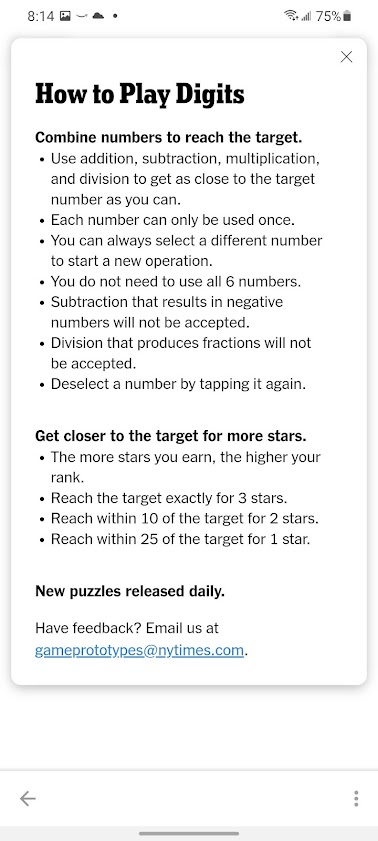

# nyt-digits-game-solver
A short python solver for the new NY Times Digits game. 

The New York Times introduced a new puzzle called "Digits" yesterday, in which the goal is to reach a target number via simple mathematical operations on a set of given input numbers.  You may use each number up to once, and you may combine numbers via addition, subtraction, multiplication, or division. For example, if the target number were 6 and the set of input numbers were [1, 2, 3], then one solution would be "1+2+3".  There may be more than one solution.  In our example, another solution would be "2\*3" (not using the 1). Another solution would be "1\*2\*3". 

The provided code defines a function `solve_puzzle` which takes in the target number and the list of input numbers and finds all solutions to the puzzle. These solutions are printed to the screen along with a count of the total number of solutions, as well as returned as a list of sequences of steps for each solution. 

```
>> solve_puzzle(6, [1,2,3])
Solution: ['2+1=3', '3+3=6']
Solution: ['2*1=2', '3*2=6']
Solution: ['2/1=2', '3*2=6']
Solution: ['3+1=4', '4+2=6']
Solution: ['3*1=3', '3*2=6']
Solution: ['3/1=3', '3*2=6']
*A total of 6 solutions were found!*
```

The game appears to still be in prototype stage, and only appears in the nytimes mobile app.  It's possible it hasn't been rolled out to everyone yet. Here are a few screenshots to show what it is like:


